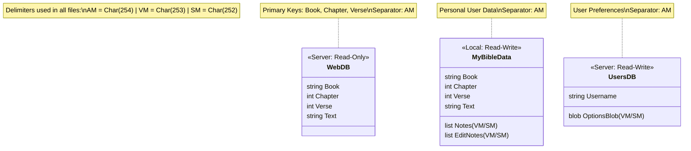

# Bible App Database Documentation

## Overview
The Walk For God Bible App utilizes a dual-layer CSV database system designed for both online (read-only) and offline (read-write) usage. This system ensures that the base Bible text remains distinct from user personalization while allowing complex data (like notes and edits) to be stored within a flat CSV structure using MultiValue System principles.

## 1. Database Schema


## 2. File Systems

### Online Database (`web.db`)
- **Purpose**: Serves as the immutable source of truth for the World English Bible (WEB) text.
- **Location**: Server-side at `public_html/bible/web.db`.
- **Format**: **UTF-8 Encoded Pick-Separated Values** (Char 254 Delimited).
- **Columns**: `Book`, `Chapter`, `Verse`, `Text`
- **Access**: Read-only via `get_bible.php` secure proxy.

### Offline Personal Database (`My Bible Data.csv`)
- **Purpose**: Stores the user's personal copy of the Bible, including their edits, notes, and versioning.
- **Location**: Client-side local file system (via File System Access API).
- **Format**: **UTF-8 Encoded Pick-Separated Values** (Char 254) with legacy CSV read support.
- **Columns**: `Book`, `Chapter`, `Verse`, `Text`, `Note`, `EditNote`
- **Access**: Read-Write directly by the browser.

### Server Options (`users.db`)
- **Purpose**: Stores user-specific settings (theme, font size, etc.) for logged-in users.
- **Location**: Server-side at `public_html/bible/users.db`.
- **Format**: **UTF-8 Encoded Pick-Separated Values** (Char 254 Delimited).
    - **Structure**: `Username (ID)` + AM + `OptionsBlob`.
    - **OptionsBlob**: `Key` + SM + `Value` + VM + `Key2` ...
- **Access**: Read-Write via `options_api.php`.

## 2. MultiValue / Pick-Style Architecture

To store rich, multi-entry data (multiple notes per verse, each with timestamps) within a single CSV cell, the application adopts a **MultiValue Database** (Pick/UniVerse) approach. This avoids the need for complex relational tables or separate JSON files.

### Separator Analysis
The system uses specific high-ASCII characters to delimit data hierarchies within the `Note` and `EditNote` columns.

**Current Implementation:**
- **Value Mark (VM)**: `Char(253)` / `\xFD`
  - **Usage**: Separates distinct entries (e.g., Note 1 vs Note 2).
- **Sub-Value Mark (SM)**: `Char(252)` / `\xFC`
  - **Usage**: Separates attributes within a single entry (e.g., Note Text vs Note Timestamp).

**Structure Example:**
```text
"Note Text A" + SM + "Timestamp A" + VM + "Note Text B" + SM + "Timestamp B"
```

### Pick Database Standard Alignment
The system explicitly adopts the traditional Pick/MultiValue separator standards:

- **Char 254 (Attribute Mark / AM)**: Used as the **Primary Field Separator** in the main database file (Encoded as `0xC3 0xBE` in UTF-8).
- **Char 253 (Value Mark / VM)**: Used to separate multiple notes or edits within a single field.
- **Char 252 (Sub-Value Mark / SM)**: Used to separate properties within a single note (e.g., text vs. date).

**Note on Attributes:**
In this application, the concept of "Columns" maps directly to Pick "Attributes", making `Char 254` the natural delimiter for the top-level data structure.

## 3. Data Parsing Logic

The `parseCSV` function in `bible.html` handles the data extraction:

```javascript
const VM = String.fromCharCode(253);
const SM = String.fromCharCode(252);

const parsePickValue = (raw) => {
    if (raw.indexOf(VM) !== -1 || raw.indexOf(SM) !== -1) {
        // MultiValue Logic
        return raw.split(VM).map(entry => {
            const parts = entry.split(SM);
            return { text: parts[0], date: parts[1] || '' };
        });
    }
    // ... Legacy fallbacks ...
};
```

### Legacy Compatibility
For backward compatibility or manual editing, the parser also accepts:
1.  **JSON Arrays**: `["Note 1", "Note 2"]`
2.  **String Delimiter**: `"Note 1 || Note 2"`

## 4. Updates & Modifications
If a change to the separator definition is required to align with a specific external Pick database standard, the `VM` and `SM` constants in `bible.html` (lines ~2065 and ~3504) would need to be updated. However, the current standard of 253/252 is fully functional and compliant for the application's needs.

## 5. Downloading Additional Bible Translations

### Using ByGod Tool

The `bygod` Python package (version 3.2.0+) can be used to download Bible translations from BibleGateway.

#### Installation
```bash
pip install bygod==3.2.0
```

#### Download Bible Translation
```bash
# Download in JSON format (recommended - includes full verse text)
bygod books -t TRANSLATION_CODE -f json -o output_directory

# Example: Download Names of God Bible (NOG)
bygod books -t NOG -f json -o public_html/bible/devs
```

**Note:** CSV format downloads structure only (no verse text). Always use JSON format for complete Bible content.

#### Available Translations
Common translation codes include:
- `NOG` - Names of God Bible
- `NIV` - New International Version
- `ESV` - English Standard Version
- `KJV` - King James Version
- `NASB` - New American Standard Bible
- `NLT` - New Living Translation

### Converting JSON to Pick DB Format

Use the `convert_nog_to_db.py` script (located in `public_html/bible/devs/`) as a template:

#### Script Features
- Reads all 66 JSON book files in canonical order
- Converts to Pick DB format (Char 254 delimited)
- Outputs single `.db` file ready for use

#### Usage
```bash
# Modify script to point to your translation's JSON directory
python public_html/bible/devs/convert_nog_to_db.py
```

#### Output Format
```
Book þ Chapter þ Verse þ Text
```
Where `þ` = Char(254) (Attribute Mark)

#### Example Files
- **Source:** `public_html/bible/devs/NOG/books/*.json`
- **Output:** `public_html/bible/devs/nog.db` (4.58 MB, 31,008 verses)

### Integration Steps
1. Download translation using `bygod` (JSON format)
2. Run conversion script to generate `.db` file
3. Place `.db` file in `public_html/bible/` directory
4. Update `get_bible.php` to serve the new translation
5. Add translation option to Bible app UI
